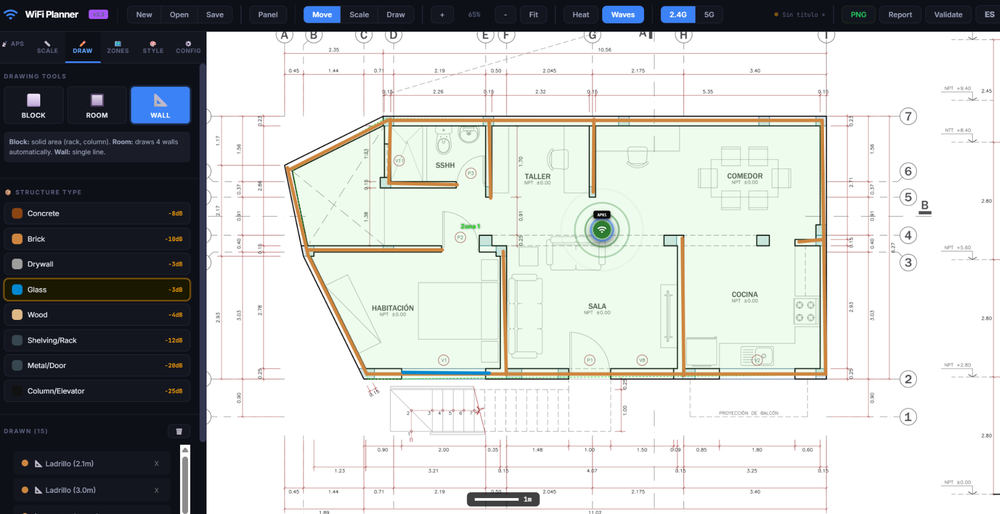

# WiFi Planner Pro v3.3

I originally built this to plan WiFi deployments in large textile warehouses — I needed a way to figure out where to put access points *before* drilling holes in walls. It's grown a lot since then, and works well for offices, retail spaces, and pretty much any indoor environment.

Built with Python (pywebview) and a full HTML/JS frontend.


## Demo



---

## What it does

The idea is straightforward: load your floor plan, place APs where you think they should go, draw your walls and obstacles, and get a signal heatmap showing how coverage will actually look.

- Load a floor plan (PDF or image) and calibrate the scale against a known distance
- Place access points and watch the signal heatmap update in real time
- Draw walls, rooms, and obstacles with different materials (concrete, brick, drywall, glass, metal, wood, shelving racks)
- Define zones with different ceiling heights and environment types
- Export coverage reports and heatmap images as PNG

> **One important caveat:** the propagation model is pretty solid (see below), but this isn't a substitute for a real site survey. Use it for planning, not as a guarantee.

---

## The signal model

This isn't a toy simulator. Under the hood it uses:

- **Log-Distance Path Loss** with real FSPL per frequency (2.4 GHz / 5 GHz)
- **Material-aware ray tracing** through walls and obstacles
- **Shadow fading** with Perlin noise (sigma=3dB, ~4–5m correlation length)
- **Rayleigh multipath fading** (±3dB in obstructed zones)
- **Knife-edge diffraction** (ITU-R P.526) near obstacle edges

---

## Drawing tools

| Tool | What it's for | Shortcut |
|---|---|---|
| **Block** | Solid area (rack, column, any material) | `D` or `R` |
| **Room** | Draws a rectangle and auto-generates 4 walls | `W` |
| **Wall** | Single line segment | `L` |

### Rack fill density

Racks have a density slider (10–100%) that scales attenuation proportionally:

| Fill | Description | Attenuation |
|---|---|---|
| 10% | Empty rack (metal frame only) | -1.2 dB |
| 50% | Half full | -6 dB |
| 80% | Full of boxes (typical) | -9.6 dB |
| 100% | Solid metal | -12 dB |

---

## Performance

Heatmap calculation runs across **multiple Web Workers** (one per CPU core, up to 8), so the UI stays responsive while it's rendering. Move an AP while it's calculating and it cancels automatically and starts fresh.

---

## Materials

| Key | Material | Attenuation |
|---|---|---|
| `1` | Concrete | -8 dB |
| `2` | Brick | -10 dB |
| `3` | Drywall | -3 dB |
| `4` | Glass | -3 dB |
| `5` | Shelving/Rack | -12 dB (adjustable by density) |
| `6` | Metal/Door | -20 dB |
| `7` | Column/Elevator shaft | -25 dB |
| `8` | Wood | -4 dB |

---

## Keyboard shortcuts

### Modes & tools

| Key | Action |
|---|---|
| `V` | Selection / move mode |
| `D` / `R` | Draw block (rectangle) |
| `W` | Draw room (4 walls) |
| `L` | Draw wall/line |
| `Space` (hold) | Temporary pan — release to return to previous mode |
| `A` | Add AP at screen center |
| `F` | Fit plan to screen |
| `H` | Toggle heatmap |
| `Esc` | Cancel current mode |
| `Enter` | Finish polygon/zone |

### File operations

| Key | Action |
|---|---|
| `Ctrl+N` | New project |
| `Ctrl+O` | Open project |
| `Ctrl+S` | Save |
| `Ctrl+Shift+S` | Save as |

---

## Getting started

### Requirements

- Python 3.8+
- Windows 10/11 (uses Edge WebView2)

### Install dependencies

```bash
pip install pywebview pymupdf pillow psutil
```

### Run

```bash
python wifi_planner_v3.py
```

### Basic workflow

1. Load a floor plan (PDF or image)
2. Calibrate the scale using a known distance
3. Select the environment type
4. Place your APs (`A` key or drag from the panel)
5. Draw walls, racks, and rooms
6. Define zones if you have areas with different ceiling heights
7. Toggle the heatmap (`H`) and review coverage
8. Export PNG and coverage report

---

## Building a standalone executable

Want to distribute this without requiring Python on the target machine?

```bash
pip install pyinstaller
pyinstaller --onefile --noconsole --name "WiFi_Planner_Pro_v3" --add-data "wifi_planner_v3.html;." --hidden-import fitz --hidden-import PIL --optimize=2 wifi_planner_v3.py
```

Or just run `compilar_v3.bat` — it handles everything automatically.

The resulting `.exe` is portable (35–45 MB) and runs without Python installed.

---

## Project structure

| File | Description |
|---|---|
| `wifi_planner_v3.py` | Python launcher (pywebview window + file I/O API) |
| `wifi_planner_v3.html` | Full UI and propagation engine |
| `requirements_v3.txt` | Python dependencies |
| `compilar_v3.bat` | Windows build script |

---

## Default configuration

The default AP is the **Fortinet FAP-431F**:
- 2.4 GHz: 20 dBm
- 5 GHz: 23 dBm
- Antenna gain: 5 dBi

Default environment: **Warehouse** (path loss exponent 3.8, 5.5m ceiling height).

---

## Contributing

This started as a personal tool and I'd love help making it better. Some areas where contributions would go a long way:

- **More AP models** — right now only the Fortinet FAP-431F is baked in
- **Linux/macOS support** — it should mostly work but hasn't been properly tested
- **Better diffraction model** — the current knife-edge implementation is simplified
- **3D propagation** — floor-to-floor signal leakage
- **Mesh/roaming visualization** — showing handoff zones between APs
- **i18n** — the UI is currently in Spanish; an English translation would help a lot
- **Antenna patterns** — directional antenna support instead of omnidirectional only

Feel free to open issues or submit PRs. No formal contribution guidelines yet — just keep it clean and test your changes.

---

## License

MIT — use it however you want.
